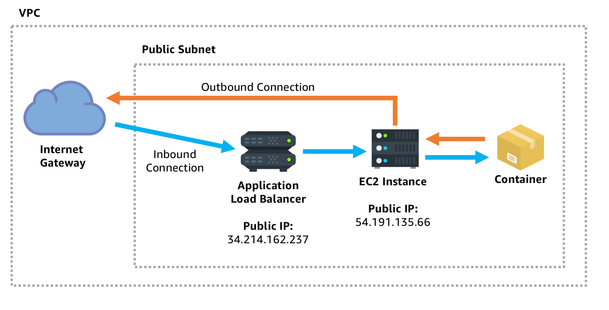
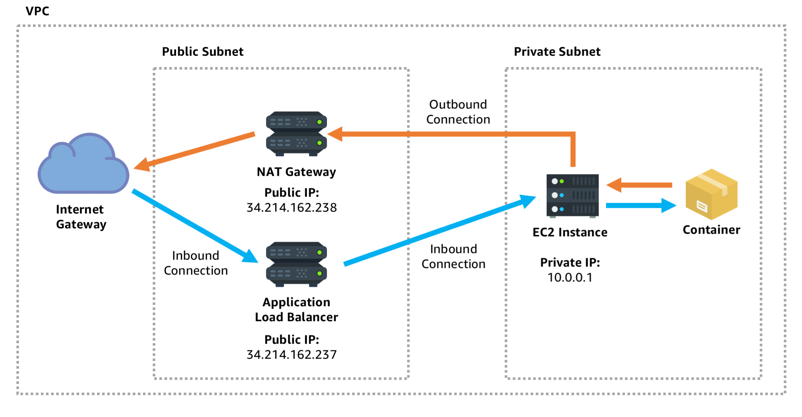
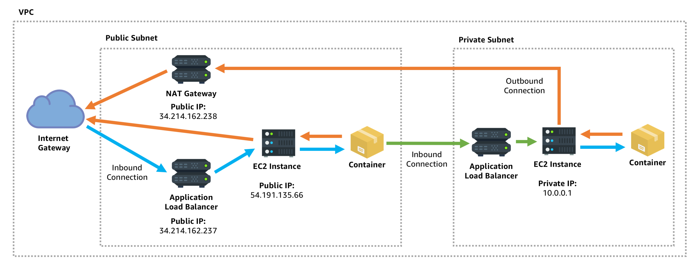
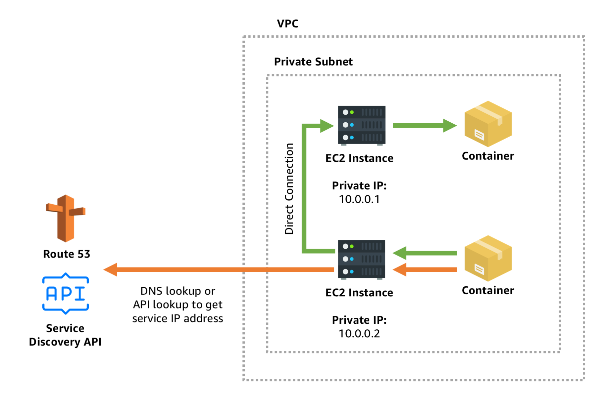

# Deploy containers using Elastic Container Service and CloudFormation

ECS and Fargate give you a lot of control over how you want to deploy containers, and how you would like them to be networked and accessed. This repository contains CloudFormation templates to help you setup several common architectures across both AWS ECS on EC2 and AWS ECS on AWS Fargate.

To get started use the AWS CLI to execute the following command. This will create a role that enables ECS on your account, so the following reference templates will work properly:

```
aws iam create-service-linked-role --aws-service-name ecs.amazonaws.com
```

Next choose one of the following common architecture stacks which many customers use. The templates can be deployed either using the AWS CLI, or in the AWS CloudFormation console.

&nbsp;

&nbsp;

### Publically networked service, with public load balancer

This is a service with direct access to the internet, and exposed publically to the internet behind a public load balancer so that people can access it. The service has a public IP address so it can initiate direct communication to other things on the internet.  This approach is one of the most simple for public facing services.


__EC2 hosted:__

1. Deploy the [EC2 Cluster with fully public network](cluster/cluster-ec2-public-vpc.yml)
2. Deploy the [external, public ALB](ingress/alb-external.yml) ingress
3. Deploy the [public load balanced EC2 service template](service/service-ec2-public-lb.yml)

__Fargate hosted:__

1. Deploy the [Fargate cluster with public subnet](cluster/cluster-fargate-public-vpc.yml)
2. Deploy the [external, public ALB](ingress/alb-external.yml) ingress
3. Deploy the [public load balanced Fargate service template](service/service-fargate-public-subnet-public-lb.yml)

&nbsp;

&nbsp;

### Privately networked service, with public load balancer

This is a service protected inside a private subnet, with no direct internet access. Because the service does not have public IP address it must initiate outbound connections through a NAT Gateway, which communicates to the external internet on the service's behalf. However, you may still want to give the public limited access to the service via a load balancer which is public.


__EC2 hosted:__

1. Deploy the [EC2 Cluster with fully private network](cluster/cluster-ec2-private-vpc.yml)
2. Deploy the [external, public ALB](ingress/alb-external.yml) ingress
3. Deploy the [public load balanced EC2 service template](service/service-ec2-public-lb.yml)

__Fargate hosted:__

1. Deploy the [Fargate cluster with public subnet](cluster/cluster-fargate-private-vpc.yml)
2. Deploy the [external, public ALB](ingress/alb-external.yml) ingress
3. Deploy the [private subnet, public load balanced Fargate service template](service/service-fargate-private-subnet-public-lb.yml)

&nbsp;

&nbsp;

### Privately networked service, with private load balancer

This is a service which is protected inside a private subnet. Not only does it not have a public IP address, but it also behind a private load balancer which can only be accessed by your own services. This is often used for internal services, where one frontend service communicates to a backend service which the public is not intended to directly access. In the diagram below notice how someone from the public internet initiates the blue connection to the public facing service in the public subnet, but that service can then initiate a green connection the private internal service:


__EC2 hosted:__

1. Deploy the [EC2 Cluster with fully private network](cluster/cluster-ec2-private-vpc.yml)
2. Deploy the [internal, private ALB](ingress/alb-internal.yml) ingress
3. Deploy the [public load balanced EC2 service template](service/service-ec2-public-lb.yml)

__Fargate hosted:__

1. Deploy the [Fargate cluster with private subnet](cluster/cluster-fargate-private-vpc.yml)
2. Deploy the [internal, private ALB](ingress/alb-internal.yml) ingress
3. Deploy the [private subnet, private load balanced Fargate service template](service/service-fargate-private-subnet-private-lb.yml)

&nbsp;

&nbsp;

### Privately networked service, with service discovery

This service type is privately networked, so it only has a private IP address, and can't receive any traffic directly from the internet. Rather than using a load balancer, this service uses a service discovery mechanism to register's its private IP address for others to discover. Another service or user can use DNS based discovery or API based discovery to get the direct IP address of the container and talk directly to it. This approach is fantastic for internal communications between private services in the same private tier of your application.


__EC2 hosted:__

_While this combination is currently possible via the API and console, it is not included here because it is pending full CloudFormation support for `bridge` mode networking combined with service discovery. Check [this example template](service/service-ec2-private-discovery.yml) to see how it will look once support is added._

__Fargate hosted:__

1. Deploy the [Fargate cluster with private subnet](cluster/cluster-fargate-private-vpc.yml)
2. Deploy the [internal service discovery](ingress/service-discovery-internal.yml) ingress
3. Deploy the [private subnet, private service discovery Fargate service template](service/service-fargate-private-subnet-private-discovery.yml)

&nbsp;

&nbsp;

## Your ingress address

__ALB Ingress:__

Once the service stack is deployed check the outputs tab of the ingress stack that you deployed to get the URL to use to access your containers. Note that an external ALB's URL will be accessible to the public from any computer, but an internal ALB's URL will only be accessible if you make the request from an instance inside the VPC, with the appropriate security group. If you want to test spin up a Cloud 9 development environment in the VPC, add its security group to the load balancer's security group and execute a `curl` command.

__Service Discovery Ingress:__

For service discovery things are a little different. The service is available at `<service name>.<domain>` where `domain` is the domain address you entered when you created the service discovery ingress. Once again if you are using a private, internal servicex discovery endpoint the DNS name will only resolve for hosts inside the VPC. You can test this by adding a Cloud 9 development environment to the VPC and executing a command like:

```
dig +short nginx.service.production
```

&nbsp;

&nbsp;

## Further customizations

Note that these baseline templates have only HTTP listeners (no SSL support) but this can be easily added to the templates once you create or import an SSL certificate into Amazon Certificate Manager. Additionally, you may want to customize the default autoscaling rules that are embedded in the service template.
